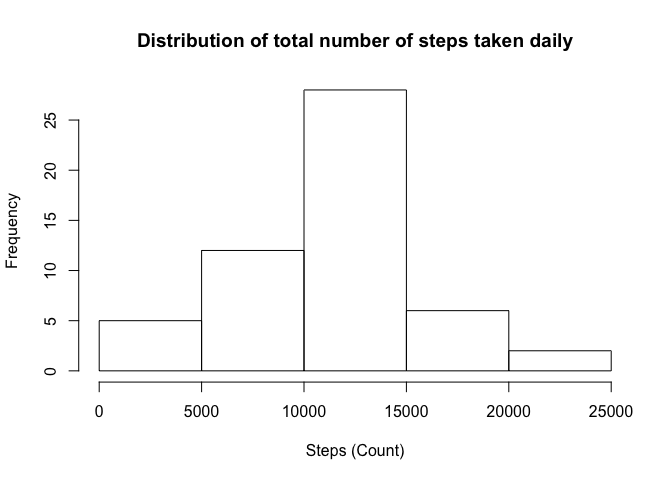
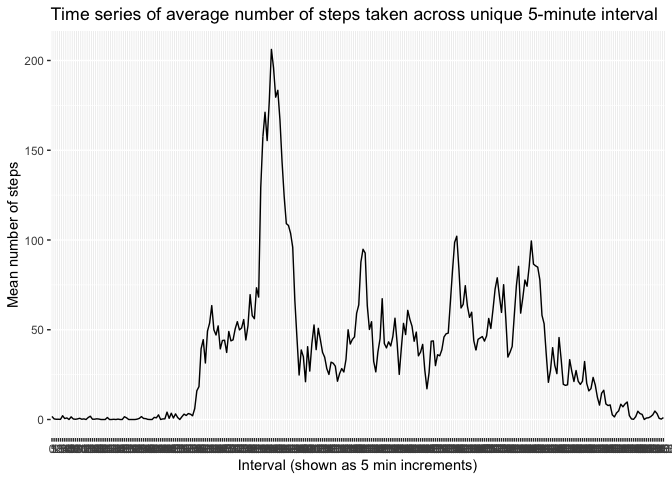
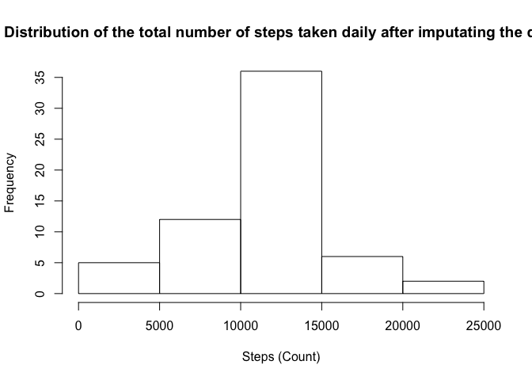
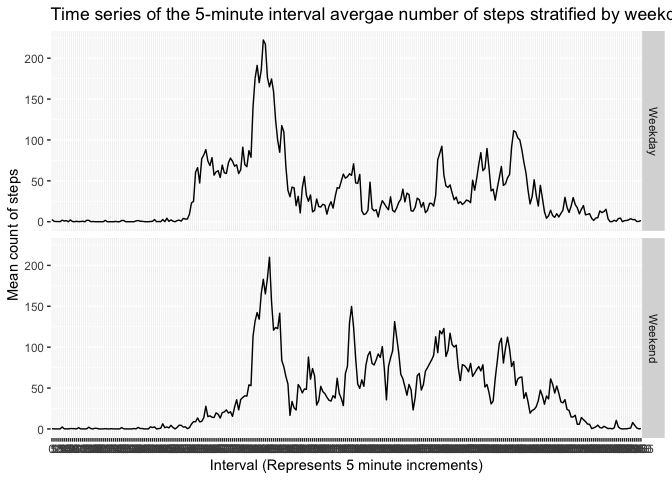

### Loading and preprocessing the data

Show any code that is needed to

1. Load the data (i.e. `read.csv()`)


```r
fitdat <-  read.csv("activity.csv")
```


2. Process/transform the data (if necessary) into a format suitable for your analysis


```r
fitdat$interval <- as.factor(fitdat$interval)
fitdat$date <- as.Date(fitdat$date)
```


### What is mean total number of steps taken per day?

For this part of the assignment, you can ignore the missing values in
the dataset.

1. Make a histogram of the total number of steps taken each day


```r
library(dplyr)
```

```
## Warning: package 'dplyr' was built under R version 3.6.2
```

```
## 
## Attaching package: 'dplyr'
```

```
## The following objects are masked from 'package:stats':
## 
##     filter, lag
```

```
## The following objects are masked from 'package:base':
## 
##     intersect, setdiff, setequal, union
```

```r
fitdat2 <- fitdat%>% filter(fitdat$steps!="NA")%>%group_by(date)%>% summarise(totSteps=sum(steps))
```

```
## `summarise()` ungrouping output (override with `.groups` argument)
```

```r
with(fitdat2, hist(totSteps, main="Distribution of total number of steps taken daily", xlab="Steps (Count)"))
```

<!-- -->


2. Calculate and report the **mean** and **median** total number of steps taken per day


```r
meanStepsa <- summary(fitdat2$totSteps)[4]
medianStepsa <- summary(fitdat2$totSteps)[3]
```


The **mean** total number of steps taken per day is 1.0766189\times 10^{4}
The **median** total number of steps taken per day is 1.0765\times 10^{4}


### What is the average daily activity pattern?

1. Make a time series plot (i.e. `type = "l"`) of the 5-minute interval (x-axis) and the average number of steps taken, averaged across all days (y-axis)


```r
library(dplyr)
library(ggplot2)
```

```
## Warning: package 'ggplot2' was built under R version 3.6.2
```

```r
mean <- fitdat%>%filter(fitdat$steps!="NA")%>% group_by(interval)%>% summarise(meanSteps=mean(steps))
```

```
## `summarise()` ungrouping output (override with `.groups` argument)
```

```r
ggplot(mean,aes(x=interval,y=meanSteps))+geom_line(group=1) +ggtitle("Time series of average number of steps taken across unique 5-minute interval") + xlab("Interval (shown as 5 min increments)")+ ylab("Mean number of steps")
```

<!-- -->

2. Which 5-minute interval, on average across all the days in the dataset, contains the maximum number of steps?


```r
library(dplyr)
maxt <- mean %>% filter(mean$meanSteps==max(mean$meanSteps))
max <- maxt[1]
```

The 5-minute interval that contains the maximum number of steps is the interval representing 835 minutes.


### Imputing missing values

Note that there are a number of days/intervals where there are missing
values (coded as `NA`). The presence of missing days may introduce
bias into some calculations or summaries of the data.

1. Calculate and report the total number of missing values in the dataset (i.e. the total number of rows with `NA`s) 


```r
fitdatmiss <- fitdat
missingsumm <- summary(fitdatmiss$steps)
missing <- missingsumm[7]
```

The total number of rows with missing values in this data set are 2304.


2. Devise a strategy for filling in all of the missing values in the dataset. The strategy does not need to be sophisticated. For example, you could use the mean/median for that day, or the mean for that 5-minute interval, etc.

**I will choose to fill in missing values with the mean number of steps taken at each distinct 5-minute interval**


3. Create a new dataset that is equal to the original dataset but with the missing data filled in.


```r
index <- with(fitdatmiss, match(interval,mean$interval))
fitdatmiss$steps <- with(fitdatmiss, ifelse(is.na(steps),mean$meanSteps[index],steps))
```


4. Make a histogram of the total number of steps taken each day and Calculate and report the **mean** and **median** total number of steps taken per day. Do these values differ from the estimates from the first part of the assignment? What is the impact of imputing missing data on the estimates of the total daily number of steps?


```r
library(dplyr)
fitdatmiss2 <- fitdatmiss%>%group_by(date)%>% summarise(totSteps=sum(steps))
```

```
## `summarise()` ungrouping output (override with `.groups` argument)
```

```r
with(fitdatmiss2, hist(totSteps, main="Distribution of the total number of steps taken daily after imputating the data", xlab="Steps (Count)"))
```

<!-- -->

```r
#mean <- fitdatb%>% group_by(date)%>% summarise(meanSteps=mean(steps))
#median <- fitdatb%>% group_by(date)%>%summarise(medianSteps=median(steps, na.rm=TRUE))

meanStepsb <- summary(fitdatmiss2$totSteps)[4]
medianStepsb <- summary(fitdatmiss2$totSteps)[3]
```


The **mean** total number of steps taken per day is 1.0766189\times 10^{4}
The **median** total number of steps taken per day is 1.0766189\times 10^{4}

**Comparing the mean and median of the total number of daily steps taken before and after imputing the data, the values are not that much different in magnitude. Altought, imputing the data did increase the frequency of values closer to the mean and median, removing some of the skewedness from the data. Imputing the data increased the median value slightly.**

Do these values differ from the estimates from the first part of the assignment? What is the impact of imputing missing data on the estimates of the total daily number of steps?

### Are there differences in activity patterns between weekdays and weekends?

For this part the `weekdays()` function may be of some help here. Use
the dataset with the filled-in missing values for this part.


1. Create a new factor variable in the dataset with two levels -- "weekday" and "weekend" indicating whether a given date is a weekday or weekend day.


```r
fitdatmiss$dayOfweek <- weekdays(as.Date(fitdatmiss$date))
fitdatmiss$dayType <- ifelse(c(fitdatmiss$dayOfweek=="Friday"|fitdatmiss$dayOfweek=="Saturday"|fitdatmiss$dayOfweek=="Sunday"), "Weekend","Weekday")
```


1. Make a panel plot containing a time series plot (i.e. `type = "l"`) of the 5-minute interval (x-axis) and the average number of steps taken, averaged across all weekday days or weekend days (y-axis). The plot should look something like the following, which was created using **simulated data**:


```r
library(dplyr)
library(ggplot2)
meanb <- fitdatmiss%>% group_by(interval,dayType)%>% summarise(meanSteps=mean(steps))
```

```
## `summarise()` regrouping output by 'interval' (override with `.groups` argument)
```

```r
ggplot(meanb,aes(x=interval,y=meanSteps)) +geom_line(group=1)+facet_grid(dayType~.) +
        ggtitle("Time series of the 5-minute interval avergae number of steps stratified by weekday type")+
        xlab("Interval (Represents 5 minute increments)") +ylab("Mean count of steps")
```

<!-- -->


** The time series stratified by weekday type (weekend or weekday) and stesps taken suggest that during the earlier portion of the day, the individual took more steps than on the weekend. **

## Submitting the Assignment

To submit the assignment:

1. Commit your completed `PA1_template.Rmd` file to the `master` branch of your git repository (you should already be on the `master` branch unless you created new ones)

2. Commit your `PA1_template.md` and `PA1_template.html` files produced by processing your R markdown file with the `knit2html()` function in R (from the **knitr** package)

3. If your document has figures included (it should) then they should have been placed in the `figure/` directory by default (unless you overrode the default). Add and commit the `figure/` directory to your git repository.

4. Push your `master` branch to GitHub.

5. Submit the URL to your GitHub repository for this assignment on the course web site.

In addition to submitting the URL for your GitHub repository, you will
need to submit the 40 character SHA-1 hash (as string of numbers from
0-9 and letters from a-f) that identifies the repository commit that
contains the version of the files you want to submit. You can do this
in GitHub by doing the following:

1. Go into your GitHub repository web page for this assignment

2. Click on the "?? commits" link where ?? is the number of commits you have in the repository. For example, if you made a total of 10 commits to this repository, the link should say "10 commits".

3. You will see a list of commits that you have made to this repository. The most recent commit is at the very top. If this represents the version of the files you want to submit, then just click the "copy to clipboard" button on the right hand side that should appear when you hover over the SHA-1 hash. Paste this SHA-1 hash into the course web site when you submit your assignment. If you don't want to use the most recent commit, then go down and find the commit you want and copy the SHA-1 hash.

A valid submission will look something like (this is just an **example**!)

```r
https://github.com/rdpeng/RepData_PeerAssessment1

7c376cc5447f11537f8740af8e07d6facc3d9645
```
